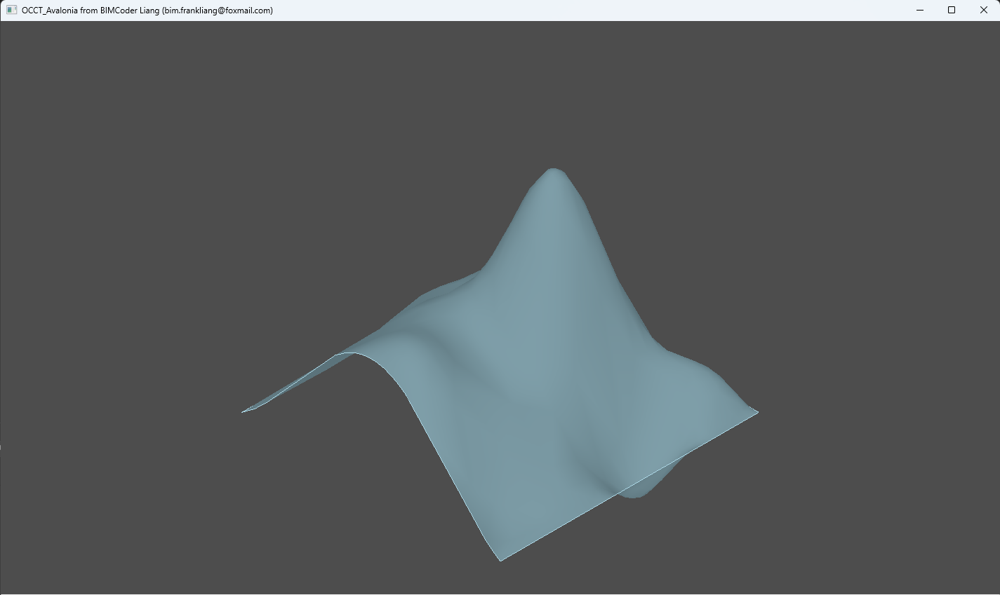

## Introduction
**OpenCascade + Avalonia UI + LNLib**  

**Open CASCADE Technology (OCCT)** is the only open-source full-scale 3D geometry library. Striving to be one of the best free cad software kernels, OCCT is widely used for the development of specialized programs dealing with the following engineering and mechanical domains: 3D modeling (CAD), manufacturing (CAM), numerical simulation (CAE), measurement equipment (CMM) and quality control (CAQ). Since its publication in 1999 as an open source CAD software kernel, OCCT has been successfully used in numerous projects ranging from building and construction to aerospace and automotive,see:[OCCT](https://dev.opencascade.org/). 

**Avalonia UI** is Free & open source UI framework for stunning, performant  cross-platform apps with .NET,see:[Avalonia](https://avaloniaui.net/). 

**LNLib**  is an open source NURBS Algorithms Kernel Library,see [LNLib](https://github.com/BIMCoderLiang/LNLib). 

## Structure
- **OCCT_CAPI**: C API of OCCT.
- **OCCT_NETWrapper**: .NET API using P/Invoke, depends OCCT_API.
- **OCCT_Avalonia**: An Avalonia App used OcctViewer UserControl.

## Build Project
- Download OpenCascade Release packages.
(I downloaded 3rdparty-vc14-64.zip & opencascade-release-no-pch.zip from V8_0_0_rc4)
- Put OCCT packages in thirdparty folder.
- Build sln file "OCCT-Avalonia.sln" in **source** folder
- Build in Debug or Release mode

## Contributing
Welcome join this project including discussions in **Issues** and make **Pull requests**.

## Contact
OCCT-Avalonia is created by Yuqing Liang (BIMCoder Liang).

- email: bim.frankliang@foxmail.com
- Weixin Official Account (微信公众号)：**BIMCoder**

## License
The source code is published under [MIT](https://mit-license.org/), the license is available [here](LICENSE).

